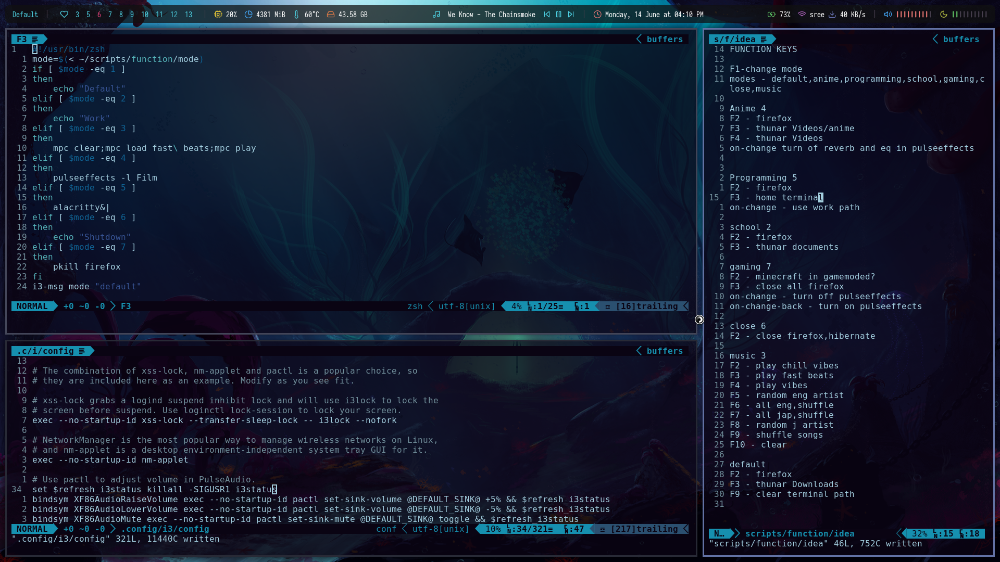
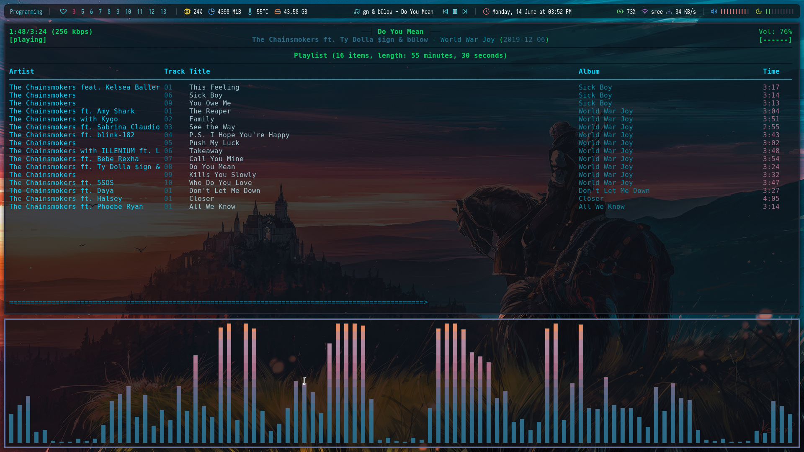
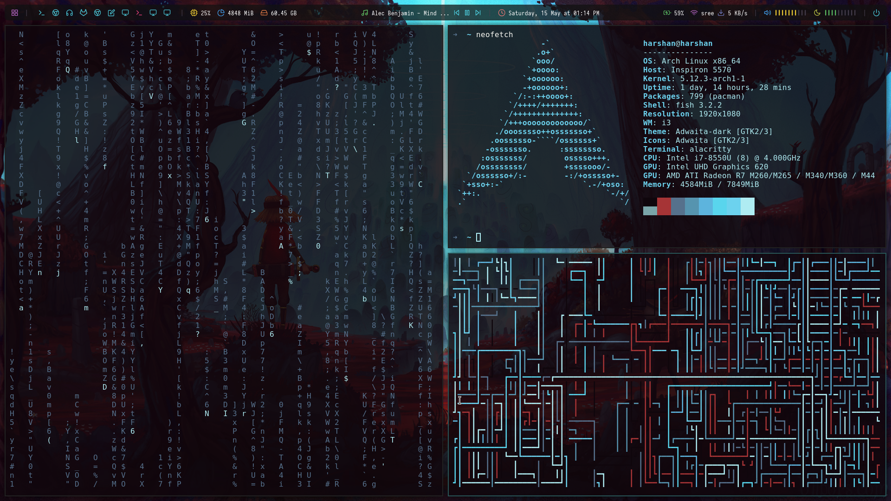

# dotfiles
+ OS: [Arch Linux](https://www.archlinux.org/)
+ WM : [i3wm](https://i3wm.org/)
+ Shell: [fish](https://fishshell.com/)
+ Bar: [Polybar](https://github.com/jaagr/polybar)
+ Lock Screen : [betterscreenlock](https://github.com/pavanjadhaw/betterlockscreen)
+ Compositor: [Picom](https://github.com/yshui/picom)
+ Terminal: [Alacritty](https://github.com/alacritty/alacritty)

# Notes
I use pywal to change terminal colors and made a custom script to change cava colors too.

I use a polybar theme by [Adi](https://github.com/adi1090x/polybar-themes), modified it to have the bar floating and have a custom script to have mpd song name to scroll.

I have modes which does special shortcuts, depending on the mode, u can find details about it in the scripts/function/idea.( I still haven't completed all the features yet)

# Screenshot

