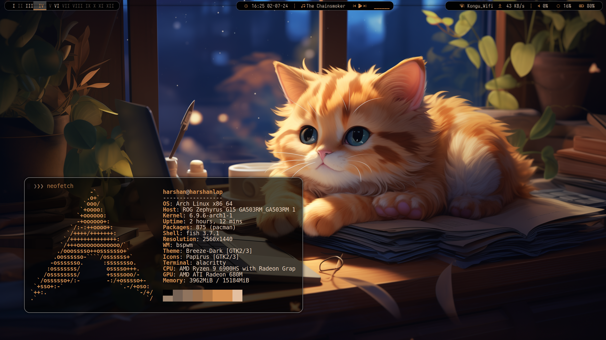
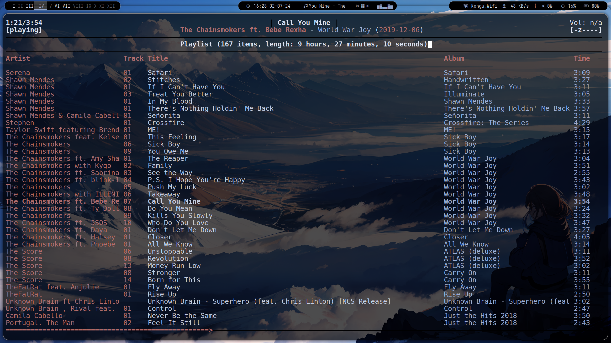
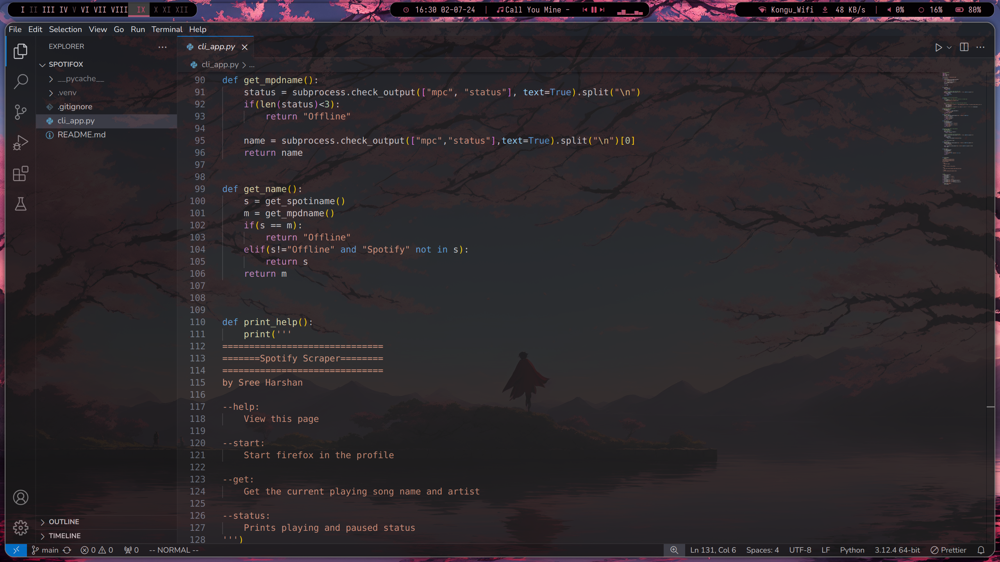

# dotfiles
+ OS: [Arch Linux](https://www.archlinux.org/)
+ WM : [bspwm](https://github.com/baskerville/bspwm)
+ Shell: [fish](https://fishshell.com/)
+ Bar: [Polybar](https://github.com/jaagr/polybar)
+ Compositor: [Picom-ftlabs-fork](https://github.com/FT-Labs)
+ Terminal: [Alacritty-smooth-cursor-fork](https://github.com/GregTheMadMonk/alacritty-smooth-cursor)
+ Menu: [Rofi](https://github.com/davatorium/rofi)
+ Visualiser: [Cava](https://github.com/karlstav/cava)

# Notes
* [wallust](https://codeberg.org/explosion-mental/wallust) used to dynamically change color from wallpaper
* [rog-control-center](https://gitlab.com/asus-linux/asusctl/-/tree/main/rog-control-center) to control the keyboard lighting
* [power-profiles-daemon](https://gitlab.freedesktop.org/upower/power-profiles-daemon) to power limit the cpu on battery, and automatically increase the fan speed when under load.
* [evremap](https://github.com/wez/evremap) used to map capslock to 2 key on my broken keyboard :/
* [spotifox](https://github.com/SreeHarshan/Spotifox) used to display spotify song title when playing. Check it out ;)
* [wallpaper-bank](https://github.com/JaKooLit/Wallpaper-Bank) from [Jakoolit](https://github.com/JaKooLit)

# Screenshot

